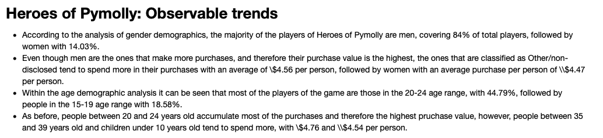

# Videogame Analysis

This project was focused on analyzing the data for a fantasy game Heroes of Pymoli. A report was generated that breaks down the game's purchasing data into meaningful insights. The report include the following:

* Player count
* Purchasing Analysis(Total)
* Gender Demographics
* Purchasing analysis(Gender)
* Age demographics
* Top spenders
* Most profitable items

## Features

* Data analysis with pandas
* Summary statistics
* Description of observable trends

## Built with 

* Python

## Outcomes

Observable trends

